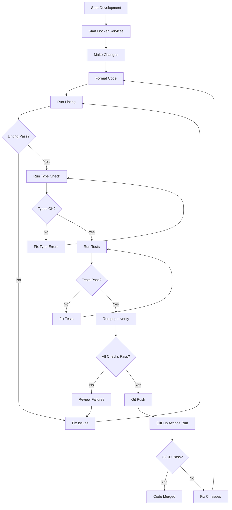

# Local Testing Workflow

This document describes the local testing workflow that must be followed before pushing code to the remote repository. This workflow ensures code quality, consistency, and prevents CI/CD failures.

## Overview

All code changes must pass local validation before being pushed to GitHub. This includes:

1. **Docker services running** - Database and cache services must be operational
2. **Code formatting** - Code must be properly formatted
3. **Linting** - No linting errors or warnings
4. **Type checking** - No TypeScript errors
5. **Unit tests** - All tests must pass

## Quick Start

### One-Command Verification

Run this command before pushing any code:

```bash
pnpm verify
```

or

```bash
pnpm pre-push
```

This will automatically check all requirements and provide clear feedback on what needs to be fixed.

## Step-by-Step Workflow

### 1. Start Docker Services

Before starting development, ensure Docker services are running:

```bash
# Start all services (Postgres, Redis, MailHog)
pnpm docker:up

# Verify services are running
docker compose ps
```

Expected output:

```
NAME                        STATUS
brisa-cubana-postgres-dev   Up (healthy)
brisa-cubana-redis-dev      Up (healthy)
brisa-cubana-mailhog-dev    Up
```

### 2. Make Your Changes

Develop your feature or fix following the project's coding standards.

### 3. Format Your Code

Before committing, ensure code is properly formatted:

```bash
# Check formatting
pnpm format:check

# Auto-format all code
pnpm format
```

### 4. Run Linting

Ensure code passes linting checks:

```bash
pnpm lint
```

This runs:

- ESLint on TypeScript/JavaScript files
- Markdownlint on documentation
- CSpell for spelling checks

### 5. Run Type Checking

Verify TypeScript types are correct:

```bash
pnpm typecheck
```

### 6. Run Tests

Execute all unit tests:

```bash
# Run all tests
pnpm test

# Run with coverage (API only)
pnpm test:coverage
```

### 7. Run Pre-Push Verification

Before pushing, run the comprehensive pre-push check:

```bash
pnpm verify
```

This script will:

- ✓ Check Docker services are running
- ✓ Check for uncommitted changes
- ✓ Verify code formatting
- ✓ Run linting
- ✓ Run type checking
- ✓ Run all tests

### 8. Push to Remote

Only after all checks pass:

```bash
git push
```

## Script Details

### Pre-Push Check Script

Location: `scripts/pre-push-check.sh`

Features:

- **Colored output** - Easy to read status messages
- **Detailed feedback** - Shows exactly what failed and why
- **Interactive prompts** - Asks for confirmation when needed
- **Auto-format option** - Can automatically fix formatting issues
- **Exit codes** - Returns 0 on success, 1 on failure

### Available Commands

| Command             | Description                    |
| ------------------- | ------------------------------ |
| `pnpm verify`       | Run full pre-push verification |
| `pnpm pre-push`     | Alias for verify               |
| `pnpm lint`         | Run all linting checks         |
| `pnpm typecheck`    | Run TypeScript type checking   |
| `pnpm test`         | Run all unit tests             |
| `pnpm format`       | Auto-format all code           |
| `pnpm format:check` | Check code formatting          |
| `pnpm docker:up`    | Start Docker services          |
| `pnpm docker:down`  | Stop Docker services           |
| `pnpm docker:reset` | Reset Docker services and data |

## CI/CD Integration

The same checks run in GitHub Actions CI/CD pipeline:

1. **Linting** - ESLint, Markdownlint, CSpell
2. **Type Checking** - TypeScript compilation
3. **Unit Tests** - Vitest with coverage
4. **Build** - Full application build

By running `pnpm verify` locally, you ensure your code will pass CI/CD checks.

## Troubleshooting

### Docker Services Not Running

**Error:** `PostgreSQL service is not running`

**Solution:**

```bash
pnpm docker:up
```

### Formatting Issues

**Error:** `Code formatting issues found`

**Solution:**

```bash
pnpm format
```

### Linting Warnings

**Error:** `Linting failed`

**Solution:**

1. Review the warnings/errors
2. Fix them manually
3. For auto-fixable issues: `pnpm lint --fix` (if supported)

### Type Errors

**Error:** `Type checking failed`

**Solution:**

1. Review TypeScript errors in output
2. Fix type issues in your code
3. Run `pnpm typecheck` again

### Test Failures

**Error:** `Tests failed`

**Solution:**

1. Review test output
2. Fix failing tests
3. Ensure test database is clean: `pnpm docker:reset`
4. Run `pnpm test` again

### Coverage Too Low

**Error:** Test coverage below threshold

**Solution:**

1. Write tests for new code
2. Temporarily exclude files from coverage (not recommended)
3. Update coverage thresholds in `vitest.config.ts` (requires justification)

## Best Practices

### 1. Run Verification Before Every Push

Always run `pnpm verify` before pushing to avoid CI/CD failures.

### 2. Keep Docker Services Running

Leave Docker services running during development to speed up testing:

```bash
# Start services once
pnpm docker:up

# They'll keep running in the background
```

### 3. Fix Issues Immediately

Don't accumulate technical debt. Fix linting, type, and test issues as you code.

### 4. Use Git Hooks

The project uses Husky for git hooks. Pre-commit hooks will run automatically.

### 5. Write Tests for New Code

All new features should include tests. Excluded files from coverage should be temporary:

- `src/routes/concierge.ts` - TODO: Add tests
- `src/services/ai.ts` - TODO: Add tests

### 6. Keep Dependencies Updated

Regularly check for dependency updates:

```bash
pnpm outdated
```

## Workflow Diagram



## Emergency Bypass

**NEVER bypass the verification process.** If you must push urgent fixes:

1. Create a hotfix branch
2. Run `pnpm verify` - no exceptions
3. Create a pull request
4. Get it reviewed before merging

## Monitoring

After pushing, monitor GitHub Actions:

```bash
# View workflow runs
gh run list

# Watch current run
gh run watch

# View specific run
gh run view <run-id>
```

## Related Documentation

- [Contributing Guide](https://github.com/albertodimas/brisa-cubana-clean-intelligence/blob/main/CONTRIBUTING.md)
- [Testing Guide](../for-developers/testing.md)
- [Deployment & CI/CD](../for-developers/deployment.md)
- [Environment Setup](https://github.com/albertodimas/brisa-cubana-clean-intelligence/blob/main/SETUP.md)

## Questions?

If you have questions about the workflow:

1. Check this documentation
2. Review CI/CD logs: `gh run view`
3. Ask in the team chat
4. Create an issue in the repository
