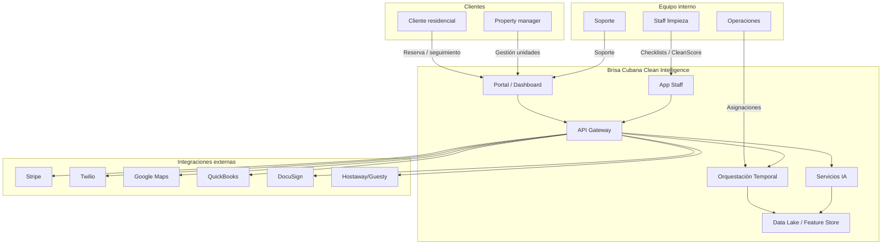

# C4 · Nivel 1 — Contexto (Q4 2025)

```mermaid
graph TB
    subgraph Clientes
        C1[Cliente residencial]
        C2[Property manager]
    end
    subgraph EquipoInterno[Equipo interno]
        A1[Operaciones]
        A2[Staff limpieza]
        A3[Soporte]
    end

    subgraph Plataforma[Brisa Cubana Clean Intelligence]
        GW[API Gateway]
        Portal[Portal / Dashboard]
        AppStaff[App Staff]
        AI[Servicios IA]
        Temporal[Orquestación Temporal]
        DataLake[Data Lake / Feature Store]
    end

    subgraph IntegracionesExternas[Integraciones externas]
        Stripe
        Twilio
        Maps[Google Maps]
        QuickBooks
        DocuSign
        PMS[Hostaway/Guesty]
    end

    C1 -->|Reserva / seguimiento| Portal
    C2 -->|Gestión unidades| Portal
    A2 -->|Checklists / CleanScore| AppStaff
    A1 -->|Asignaciones| Temporal
    A3 -->|Soporte| Portal

    Portal --> GW
    AppStaff --> GW
    GW --> Temporal
    GW --> AI
    Temporal --> DataLake
    AI --> DataLake

    GW --> Stripe
    GW --> Twilio
    GW --> Maps
    GW --> QuickBooks
    GW --> DocuSign
    GW --> PMS
```

> Propietario: Tech Lead. Actualizado 29 sep 2025.
