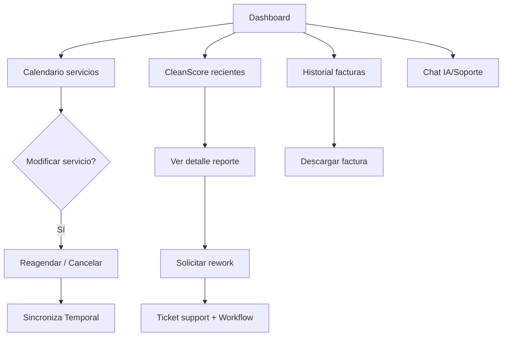

# User Flow R2 · Panel cliente

```mermaid
flowchart TD
    A[Dashboard] --> B[Calendario servicios]
    A --> C[CleanScore recientes]
    A --> D[Historial facturas]
    B --> E{Modificar servicio?}
    E -->|Sí| F[Reagendar / Cancelar]
    F --> G[Sincroniza Temporal]
    C --> H[Ver detalle reporte]
    H --> I[Solicitar rework]
    I --> J[Ticket support + Workflow]
    D --> K[Descargar factura]
    A --> L[Chat IA/Soporte]
```

> Propietario: Product Designer. Última revisión 29 sep 2025.
