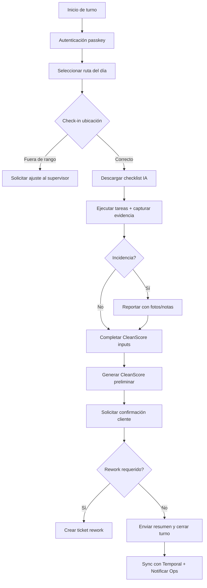

# User Flow R3 · App Staff

```mermaid
flowchart TD
    A[Inicio de turno] --> B[Autenticación passkey]
    B --> C[Seleccionar ruta del día]
    C --> D{Check-in ubicación}
    D -->|Fuera de rango| E[Solicitar ajuste al supervisor]
    D -->|Correcto| F[Descargar checklist IA]
    F --> G[Ejecutar tareas + capturar evidencia]
    G --> H{Incidencia?}
    H -->|Sí| I[Reportar con fotos/notas]
    H -->|No| J[Completar CleanScore inputs]
    I --> J
    J --> K[Generar CleanScore preliminar]
    K --> L[Solicitar confirmación cliente]
    L --> M{Rework requerido?}
    M -->|Sí| N[Crear ticket rework]
    M -->|No| O[Enviar resumen y cerrar turno]
    O --> P[Sync con Temporal + Notificar Ops]
```

> Propietario: Product Designer & Ops Lead. Última revisión 29 sep 2025.
