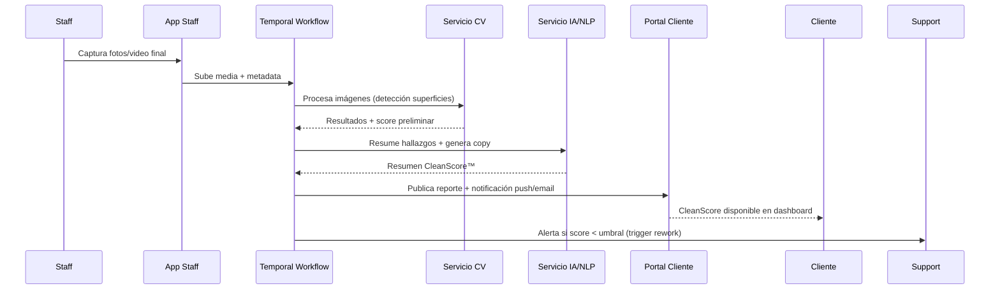

# Secuencia · CleanScore publicación

```mermaid
sequenceDiagram
    participant Staff
    participant App as App Staff
    participant Workflow as Temporal Workflow
    participant CV as Servicio CV
    participant AI as Servicio IA/NLP
    participant Portal as Portal Cliente

    Staff->>App: Captura fotos/video final
    App->>Workflow: Sube media + metadata
    Workflow->>CV: Procesa imágenes (detección superficies)
    CV-->>Workflow: Resultados + score preliminar
    Workflow->>AI: Resume hallazgos + genera copy
    AI-->>Workflow: Resumen CleanScore™
    Workflow->>Portal: Publica reporte + notificación push/email
    Portal-->>Cliente: CleanScore disponible en dashboard
    Workflow->>Support: Alerta si score < umbral (trigger rework)
```

> Propietario: AI Lead. Última revisión 29 sep 2025.
