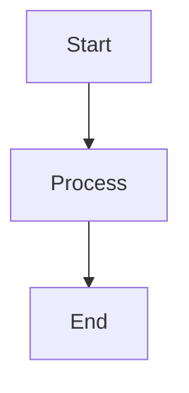

# Scripts - Brisa Cubana Clean Intelligence

Scripts de automatización y utilidades para desarrollo, testing y deployment.

## 📂 Scripts Disponibles

### `turbo.js`

Wrapper personalizado para Turborepo con manejo de errores mejorado.

**Uso:**

```bash
node scripts/turbo.js run dev
node scripts/turbo.js run build
node scripts/turbo.js run test
```

**Características:**

- Detección automática de Turbo CLI
- Mensajes de error claros
- Compatible con todos los comandos de Turbo

---

### `setup_env.sh`

Configuración inicial del entorno de desarrollo para MkDocs.

**Uso:**

```bash
./scripts/setup_env.sh
```

**Acciones:**

- Crea virtual environment Python (`.venv`)
- Instala MkDocs 1.6.1
- Instala Material theme 9.6.20
- Instala plugins necesarios

---

### `mkdocs_serve.sh`

Levanta el servidor de documentación MkDocs en modo desarrollo.

**Uso:**

```bash
./scripts/mkdocs_serve.sh
```

**Puerto:** `http://localhost:8000`

---

### `stripe_listen.sh`

Escucha webhooks de Stripe en desarrollo local.

**Uso:**

```bash
./scripts/stripe_listen.sh
```

**Requiere:**

- Stripe CLI instalado (`brew install stripe/stripe-cli/stripe`)
- Autenticación previa (`stripe login`)

**Acción:**

- Forward de webhooks a `localhost:4000/api/payments/webhook`
- Imprime `STRIPE_WEBHOOK_SECRET` en consola

---

### `stripe_trigger.sh`

Dispara eventos de Stripe para testing local.

**Uso:**

```bash
./scripts/stripe_trigger.sh checkout.session.completed
./scripts/stripe_trigger.sh payment_intent.payment_failed
```

**Eventos soportados:**

- `checkout.session.completed`
- `checkout.session.expired`
- `payment_intent.payment_failed`
- Cualquier otro evento de Stripe

---

### `generate_diagrams.mjs`

Genera diagramas Mermaid como imágenes PNG/SVG.

**Uso:**

```bash
node scripts/generate_diagrams.mjs
```

**Requiere:**

- `@mermaid-js/mermaid-cli` instalado

**Input:** Archivos `.mmd` en `docs/resources/diagrams/`
**Output:** Imágenes en `docs/_build/diagrams/`

**Ejemplo:**



---

### `reconcile-payments.ts` (en apps/api/scripts/)

Script de conciliación de pagos con Stripe (ejecutado por cron).

**Ubicación:** `apps/api/scripts/reconcile-payments.ts`

**Uso:**

```bash
cd apps/api
pnpm payments:reconcile
```

**Acción:**

- Consulta bookings con `paymentStatus = PENDING_PAYMENT` o `REQUIRES_ACTION`
- Verifica estado en Stripe API
- Actualiza estados locales
- Crea alertas si detecta problemas

**Variables requeridas:**

```bash
DATABASE_URL="postgresql://..."
STRIPE_SECRET_KEY="sk_..."
ALERTS_SLACK_WEBHOOK="https://hooks.slack.com/..." # opcional
```

**Cron sugerido:**

```bash
# Ejecutar cada hora
0 * * * * cd /path/to/apps/api && pnpm payments:reconcile
```

---

## 🚀 Uso en CI/CD

### GitHub Actions

Los scripts se usan en workflows:

```yaml
# .github/workflows/ci.yml
- name: Setup environment
  run: ./scripts/setup_env.sh

- name: Build docs
  run: pnpm docs:build

# .github/workflows/payments-reconcile.yml
- name: Reconcile payments
  run: cd apps/api && pnpm payments:reconcile
  env:
    DATABASE_URL: ${{ secrets.DATABASE_URL }}
    STRIPE_SECRET_KEY: ${{ secrets.STRIPE_SECRET_KEY }}
```

---

## 🛠️ Crear Nuevo Script

### Script Bash

```bash
#!/bin/bash
# scripts/my-script.sh

set -e  # Exit on error

echo "Running my script..."

# Tu código aquí

echo "Done!"
```

**Hacer ejecutable:**

```bash
chmod +x scripts/my-script.sh
```

### Script Node.js/TypeScript

```typescript
// scripts/my-script.mjs (ESM)
import { execSync } from "child_process";

console.log("Running my script...");

try {
  execSync("pnpm build", { stdio: "inherit" });
  console.log("Build successful!");
} catch (error) {
  console.error("Build failed:", error);
  process.exit(1);
}
```

**Ejecutar:**

```bash
node scripts/my-script.mjs
```

---

## 📝 Best Practices

1. **Documentar cada script** en este README
2. **Agregar comentarios** en el código del script
3. **Validar dependencias** antes de ejecutar
4. **Mensajes claros** de error y éxito
5. **Exit codes** apropiados (0 = éxito, 1 = error)
6. **Idempotencia** cuando sea posible

---

## 🔧 Troubleshooting

### Error: "Permission denied"

```bash
chmod +x scripts/nombre-del-script.sh
```

### Error: "Stripe CLI not found"

```bash
# macOS
brew install stripe/stripe-cli/stripe

# Linux
# Ver https://stripe.com/docs/stripe-cli
```

### Error: "Python venv not found"

```bash
./scripts/setup_env.sh
```

---

## 📚 Recursos

- [Turborepo Docs](https://turbo.build/repo/docs)
- [MkDocs Docs](https://www.mkdocs.org/)
- [Stripe CLI Docs](https://stripe.com/docs/stripe-cli)
- [Mermaid CLI Docs](https://github.com/mermaid-js/mermaid-cli)

---

## 🤝 Contribuir

Al agregar un nuevo script:

1. Agregarlo a este README
2. Incluir ejemplos de uso
3. Documentar variables de entorno requeridas
4. Agregar a `.gitignore` si genera archivos temporales
